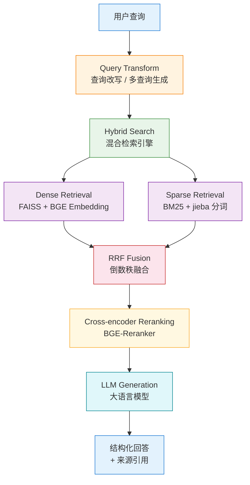
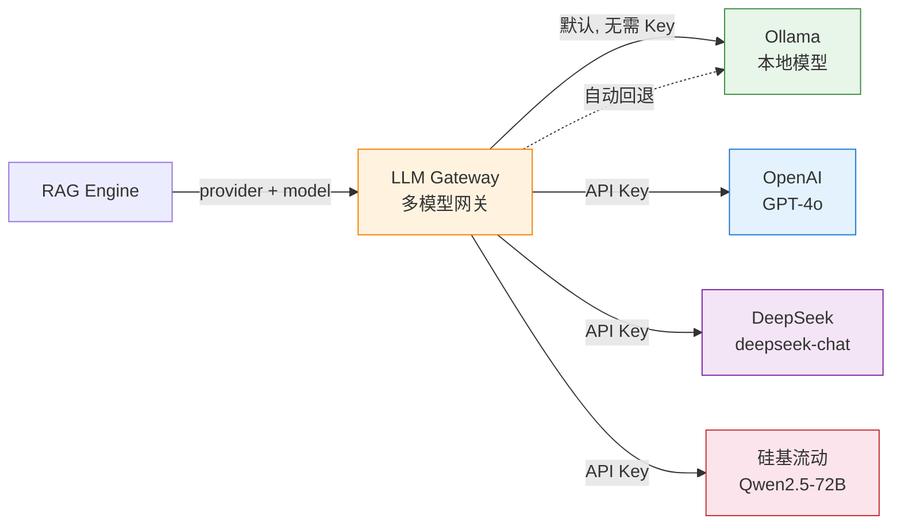
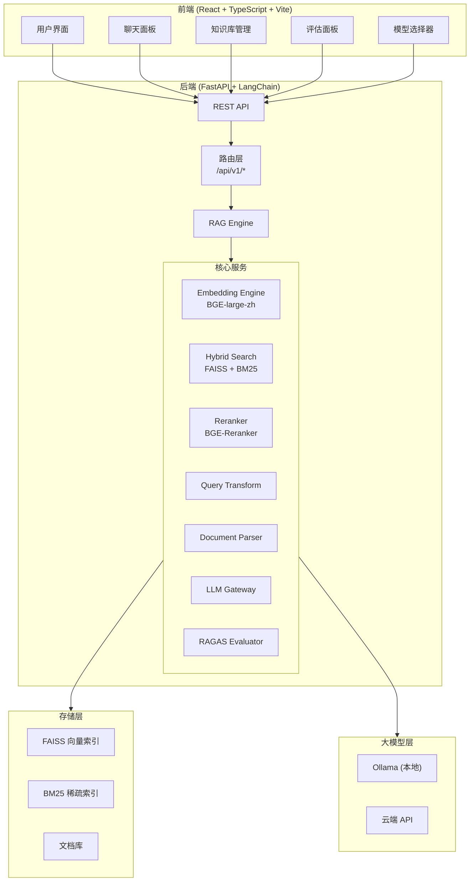

<div align="center">

# 环境工程 RAG Ultimate

### 企业级智能问答系统

**基于 Hybrid Search + Reranking + Query Transform + 多模型网关 + RAGAS 评估 的企业级 RAG 问答系统**

[](https://www.python.org/downloads/)
[](https://fastapi.tiangolo.com/)
[](https://react.dev/)
[](https://www.typescriptlang.org/)
[](https://ollama.com/)
[](LICENSE)

</div>

---

## 目录

- [系统架构](#系统架构)
- [核心特性](#核心特性)
- [技术栈](#技术栈)
- [项目结构](#项目结构)
- [快速开始](#快速开始)
- [配置说明](#配置说明)
- [API 文档](#api-文档)
- [评估体系](#评估体系)
- [知识库管理](#知识库管理)
- [部署指南](#部署指南)
- [常见问题](#常见问题-faq)
- [许可证](#许可证)

---

## 系统架构

### 完整数据流架构



### 多模型网关架构



### 系统整体架构



---

## 核心特性

### 1. 本地模型支持（Ollama，无需 API Key）

- 内置 Ollama 集成，**零配置即可运行**，无需任何 API Key
- 支持多种开源大模型：`qwen2.5`、`deepseek-r1`、`llama3.1`、`gemma2`、`mistral` 等
- 自动检测 Ollama 服务状态，智能回退机制

### 2. 多模型无缝切换

- 统一的 LLM Gateway 网关，一套代码适配多个 LLM Provider
- 支持 **OpenAI** (GPT-4o) / **Qwen** / **DeepSeek** / **硅基流动**
- 运行时动态切换模型，无需重启服务
- 自动回退策略：当首选 Provider 不可用时，自动切换至可用模型

### 3. Hybrid Search 混合检索

- **Dense Retrieval**：FAISS 向量索引 + `BAAI/bge-large-zh-v1.5` 中文 Embedding
- **Sparse Retrieval**：BM25 算法 + jieba 中文分词
- **RRF 融合**：Reciprocal Rank Fusion 倒数秩融合算法，可配置权重（默认 Dense 0.7 / Sparse 0.3）
- 兼顾语义理解和关键词精确匹配，显著提升检索召回率

### 4. Cross-encoder Reranking

- 使用 `BAAI/bge-reranker-base` Cross-encoder 模型进行精排
- 对 RRF 融合后的候选文档进行二次相关性打分
- 可通过配置 `USE_RERANKER=true/false` 灵活开关
- 可配置 `RERANKER_TOP_K` 控制精排候选数量

### 5. Query Transform 查询转换

- **Query Rewriting（查询改写）**：LLM 将用户口语化问题改写为更精确的检索语句
- **Multi-Query（多查询生成）**：生成多个查询变体，从不同角度检索后合并结果
- 提升复杂问题的检索覆盖率

### 6. RAGAS 自动化评估

- 内置 12 题环境工程黄金测试集（Golden Dataset）
- 四维评估指标：**Faithfulness**（忠实度）、**Answer Relevancy**（答案相关性）、**Context Precision**（上下文精确度）、**Context Recall**（上下文召回率）
- 一键运行评估，自动生成 JSON 格式报告
- 支持历史报告对比

### 7. 多格式文档解析

| 格式 | 扩展名 | 解析方式 |
|------|--------|----------|
| 纯文本 | `.txt` | 多编码自动检测（UTF-8/GBK/GB2312） |
| Markdown | `.md` | 正则清洗标题/加粗/代码块 |
| PDF | `.pdf` | pypdf 逐页提取文本 |
| Word | `.docx` / `.doc` | python-docx 段落提取 |
| HTML | `.html` / `.htm` | BeautifulSoup 清洗 |
| Excel | `.xlsx` | openpyxl 逐表提取 |

### 8. 流式输出（SSE）

- 基于 Server-Sent Events 的流式响应
- 逐 token 输出，实时显示生成过程
- 提升用户交互体验，减少等待感知

### 9. 完整前后端分离

- **后端**：FastAPI + LangChain，模块化服务架构
- **前端**：React 18 + TypeScript + Vite 5，组件化设计
- RESTful API + SSE 流式接口
- CORS 跨域支持，开发代理配置

---

## 技术栈

### 后端

| 类别 | 技术 | 版本 | 用途 |
|------|------|------|------|
| Web 框架 | FastAPI | 0.115.0 | 高性能异步 API 服务 |
| ASGI 服务器 | Uvicorn | 0.32.0 | 生产级服务器 |
| RAG 框架 | LangChain | 0.3.0 | LLM 编排与链式调用 |
| 向量数据库 | FAISS (CPU) | 1.9.0 | 高效稠密向量检索 |
| 稀疏检索 | rank-bm25 | 0.2.2 | BM25 算法实现 |
| 中文分词 | jieba | 0.42.1 | 中文分词与搜索 |
| Embedding | sentence-transformers | 3.3.0 | HuggingFace Embedding 加载 |
| Reranker | sentence-transformers CrossEncoder | - | BGE-Reranker 精排 |
| PDF 解析 | pypdf | 5.1.0 | PDF 文本提取 |
| Word 解析 | python-docx | 1.1.2 | Word 文档解析 |
| HTML 解析 | beautifulsoup4 | 4.12.3 | HTML 清洗 |
| Excel 解析 | openpyxl | 3.1.0 | Excel 表格提取 |
| 本地 LLM | ollama | 0.4.0 | Ollama Python 客户端 |
| 评估框架 | ragas | 0.2.0 | RAG 质量评估 |
| 数据处理 | numpy / pandas | 1.26.4 / 2.2.0 | 数值计算与数据分析 |
| HTTP 客户端 | httpx | 0.27.0 | 异步 HTTP 请求 |
| 日志 | loguru | 0.7.0 | 结构化日志 |

### 前端

| 类别 | 技术 | 版本 | 用途 |
|------|------|------|------|
| UI 框架 | React | 18.3 | 组件化用户界面 |
| 语言 | TypeScript | 5.7 | 类型安全开发 |
| 构建工具 | Vite | 5.4 | 极速开发构建 |
| Markdown 渲染 | react-markdown | 9.0 | 回答内容渲染 |
| GFM 支持 | remark-gfm | 4.0 | GitHub 风格 Markdown |
| HTTP 客户端 | axios | 1.7 | API 请求 |

### LLM 模型

| Provider | 模型 | 类型 | 说明 |
|----------|------|------|------|
| **Ollama** | qwen2.5:7b/14b/32b/72b | 本地 | 推荐默认模型 |
| **Ollama** | deepseek-r1:7b | 本地 | 推理增强 |
| **Ollama** | llama3.1:8b | 本地 | Meta 开源 |
| **Ollama** | gemma2:9b | 本地 | Google 开源 |
| **OpenAI** | gpt-4o / gpt-4o-mini | 云端 | 最强通用能力 |
| **DeepSeek** | deepseek-chat / deepseek-reasoner | 云端 | 高性价比推理 |
| **硅基流动** | Qwen2.5-72B-Instruct / DeepSeek-V3 | 云端 | 开源模型聚合 |

### Embedding & Reranker

| 组件 | 模型 | 维度 | 说明 |
|------|------|------|------|
| Embedding | `BAAI/bge-large-zh-v1.5` | 1024 | 中文语义向量模型 |
| Reranker | `BAAI/bge-reranker-base` | - | 中文 Cross-encoder 重排序 |

---

## 项目结构

```
env-rag-ultimate/
├── backend/                          # 后端服务
│   ├── main.py                       # FastAPI 应用入口
│   ├── requirements.txt              # Python 依赖
│   ├── .env.example                  # 环境变量模板
│   └── app/
│       ├── __init__.py
│       ├── api/
│       │   ├── __init__.py
│       │   └── routes.py             # REST API 路由定义
│       ├── core/
│       │   ├── __init__.py
│       │   └── config.py             # 系统配置（Pydantic Settings）
│       ├── models/
│       │   ├── __init__.py
│       │   └── schemas.py            # Pydantic 数据模型
│       └── services/
│           ├── __init__.py
│           ├── embedding/
│           │   ├── __init__.py
│           │   └── engine.py         # Embedding 引擎（HuggingFace/OpenAI）
│           ├── evaluation/
│           │   ├── __init__.py
│           │   └── evaluator.py      # RAGAS 自动化评估
│           ├── llm/
│           │   ├── __init__.py
│           │   └── gateway.py        # 多模型 LLM 网关
│           ├── parser/
│           │   ├── __init__.py
│           │   └── document_parser.py # 多格式文档解析器
│           ├── query_transform/
│           │   ├── __init__.py
│           │   └── transformer.py   # 查询改写 / 多查询生成
│           └── rag/
│               ├── __init__.py
│               ├── engine.py         # RAG 核心引擎
│               └── hybrid_search.py  # Hybrid Search 混合检索
├── frontend/                         # 前端应用
│   ├── index.html                    # HTML 入口
│   ├── package.json                  # Node.js 依赖
│   ├── tsconfig.json                 # TypeScript 配置
│   ├── tsconfig.node.json
│   ├── vite.config.ts                # Vite 构建配置
│   ├── public/
│   │   └── favicon.svg
│   └── src/
│       ├── main.tsx                  # React 入口
│       ├── App.tsx                   # 根组件 + Context
│       ├── index.css                 # 全局样式
│       ├── vite-env.d.ts
│       ├── api/
│       │   └── client.ts             # Axios API 客户端
│       ├── components/
│       │   ├── ChatPanel.tsx         # 聊天面板
│       │   ├── Evaluation.tsx        # 评估面板
│       │   ├── KnowledgeBase.tsx     # 知识库管理
│       │   ├── Layout.tsx            # 页面布局
│       │   ├── MessageBubble.tsx     # 消息气泡
│       │   ├── ModelSelector.tsx     # 模型选择器
│       │   ├── QueryOptions.tsx      # 查询选项
│       │   ├── Sidebar.tsx          # 侧边栏导航
│       │   ├── SourceCard.tsx        # 来源卡片
│       │   └── SystemStatus.tsx      # 系统状态
│       ├── hooks/
│       │   ├── useApi.ts             # API 请求 Hook
│       │   └── useChat.ts            # 聊天逻辑 Hook
│       ├── types/
│       │   └── index.ts             # TypeScript 类型定义
│       └── utils/
│           └── constants.ts          # 常量定义
├── data/                             # 数据目录
│   ├── knowledge_base/              # 知识库文档
│   │   ├── 01_水污染控制.txt
│   │   ├── 02_大气污染控制.txt
│   │   ├── 03_环境影响评价.txt
│   │   ├── 04_固体废物处理.txt
│   │   ├── 05_环境法规标准.txt
│   │   └── 06_碳排放管理.txt
│   ├── uploads/                      # 上传文档目录
│   ├── vector_store/                 # FAISS 向量索引存储
│   └── evaluation/                   # 评估数据
│       ├── golden_set.json           # 黄金测试集
│       └── results/                  # 评估报告
└── README.md                         # 项目文档
```

---

## 快速开始

### 环境要求

| 依赖 | 最低版本 | 推荐版本 | 说明 |
|------|---------|---------|------|
| Python | 3.11+ | 3.11 | 后端运行环境 |
| Node.js | 18+ | 20 LTS | 前端构建工具 |
| Ollama | 最新版 | 最新版 | 本地 LLM 推理引擎 |
| Git | - | 最新版 | 代码管理 |

### 安装步骤

#### 1. 克隆项目

```bash
git clone https://github.com/your-username/env-rag-ultimate.git
cd env-rag-ultimate
```

#### 2. 安装后端依赖

```bash
cd backend
python -m venv venv
source venv/bin/activate        # Linux/macOS
# venv\Scripts\activate         # Windows
pip install -r requirements.txt
```

#### 3. 安装 Ollama 及模型

```bash
# 安装 Ollama（参考 https://ollama.com）
curl -fsSL https://ollama.com/install.sh | sh

# 启动 Ollama 服务
ollama serve &

# 拉取推荐模型
ollama pull qwen2.5:7b
```

> **提示**：首次启动时 Embedding 模型（`BAAI/bge-large-zh-v1.5`）和 Reranker 模型（`BAAI/bge-reranker-base`）会自动从 HuggingFace 下载，请确保网络通畅。

#### 4. 配置环境变量

```bash
cp backend/.env.example backend/.env
# 根据需要编辑 .env 文件
```

#### 5. 构建知识库

```bash
# 启动后端服务
cd backend
python main.py

# 在另一个终端，调用 API 构建知识库
curl -X POST http://localhost:8000/api/v1/kb/build
```

#### 6. 安装并启动前端

```bash
cd frontend
npm install
npm run dev
```

#### 7. 访问系统

打开浏览器访问 **http://localhost:3000**，即可开始使用。

### 一键启动（开发模式）

```bash
# 终端 1：启动后端
cd backend && source venv/bin/activate && python main.py

# 终端 2：启动前端
cd frontend && npm run dev
```

---

## 配置说明

### 环境变量配置（.env）

基于 `backend/.env.example` 创建 `.env` 文件，以下为所有可配置项：

#### 应用配置

| 变量名 | 默认值 | 说明 |
|--------|--------|------|
| `DEBUG` | `false` | 调试模式开关 |

#### Ollama 本地模型（默认，无需 API Key）

| 变量名 | 默认值 | 说明 |
|--------|--------|------|
| `OLLAMA_BASE_URL` | `http://localhost:11434` | Ollama 服务地址 |
| `OLLAMA_DEFAULT_MODEL` | `qwen2.5:7b` | Ollama 默认模型 |

#### 默认模型

| 变量名 | 默认值 | 说明 |
|--------|--------|------|
| `DEFAULT_LLM_PROVIDER` | `ollama` | 默认 LLM 提供商 |
| `DEFAULT_LLM_MODEL` | `qwen2.5:7b` | 默认 LLM 模型 |

#### 云端 LLM API Key（按需配置）

| 变量名 | 默认值 | 说明 |
|--------|--------|------|
| `OPENAI_API_KEY` | - | OpenAI API Key（不填则不可用） |
| `OPENAI_BASE_URL` | `https://api.openai.com/v1` | OpenAI API 地址 |
| `DEEPSEEK_API_KEY` | - | DeepSeek API Key |
| `DEEPSEEK_BASE_URL` | `https://api.deepseek.com/v1` | DeepSeek API 地址 |
| `SILICONFLOW_API_KEY` | - | 硅基流动 API Key |
| `SILICONFLOW_BASE_URL` | `https://api.siliconflow.cn/v1` | 硅基流动 API 地址 |

#### Embedding 模型

| 变量名 | 默认值 | 说明 |
|--------|--------|------|
| `EMBEDDING_MODEL` | `BAAI/bge-large-zh-v1.5` | Embedding 模型名称 |
| `EMBEDDING_DEVICE` | `cpu` | 推理设备（`cpu` / `cuda`） |

#### Reranker 模型

| 变量名 | 默认值 | 说明 |
|--------|--------|------|
| `RERANKER_MODEL` | `BAAI/bge-reranker-base` | Reranker 模型名称 |
| `USE_RERANKER` | `true` | 是否启用 Reranking |
| `RERANKER_TOP_K` | `20` | Reranker 候选文档数量 |

#### Query Transform

| 变量名 | 默认值 | 说明 |
|--------|--------|------|
| `ENABLE_QUERY_REWRITE` | `true` | 是否启用查询改写 |
| `ENABLE_MULTI_QUERY` | `false` | 是否启用多查询生成 |

#### RAG 参数

| 变量名 | 默认值 | 说明 |
|--------|--------|------|
| `CHUNK_SIZE` | `512` | 文档分块大小（字符数） |
| `CHUNK_OVERLAP` | `100` | 分块重叠大小 |
| `TOP_K_RETRIEVAL` | `5` | 最终返回文档数量 |
| `BM25_WEIGHT` | `0.3` | BM25 稀疏检索权重 |
| `DENSE_WEIGHT` | `0.7` | Dense 稠密检索权重 |

### Ollama 配置

1. **安装 Ollama**：访问 [ollama.com](https://ollama.com) 下载安装
2. **启动服务**：`ollama serve`（通常安装后自动启动为系统服务）
3. **拉取模型**：

```bash
# 推荐模型
ollama pull qwen2.5:7b          # 通用中文，速度快
ollama pull qwen2.5:14b         # 更高质量
ollama pull deepseek-r1:7b      # 推理增强

# 验证安装
ollama list                     # 查看已安装模型
curl http://localhost:11434/api/tags  # 检查服务状态
```

4. **自定义模型目录**：如需更改模型存储路径，设置环境变量 `OLLAMA_MODELS`

### 各 LLM Provider 配置示例

#### 纯本地模式（默认）

```env
DEFAULT_LLM_PROVIDER=ollama
DEFAULT_LLM_MODEL=qwen2.5:7b
OLLAMA_BASE_URL=http://localhost:11434
```

#### OpenAI 模式

```env
DEFAULT_LLM_PROVIDER=openai
DEFAULT_LLM_MODEL=gpt-4o
OPENAI_API_KEY=sk-your-api-key-here
OPENAI_BASE_URL=https://api.openai.com/v1
```

#### DeepSeek 模式

```env
DEFAULT_LLM_PROVIDER=deepseek
DEFAULT_LLM_MODEL=deepseek-chat
DEEPSEEK_API_KEY=sk-your-api-key-here
DEEPSEEK_BASE_URL=https://api.deepseek.com/v1
```

#### 硅基流动模式

```env
DEFAULT_LLM_PROVIDER=siliconflow
DEFAULT_LLM_MODEL=Qwen/Qwen2.5-72B-Instruct
SILICONFLOW_API_KEY=sk-your-api-key-here
SILICONFLOW_BASE_URL=https://api.siliconflow.cn/v1
```

---

## API 文档

所有 API 端点前缀为 `/api/v1`，完整 Swagger 文档可访问 `http://localhost:8000/docs`。

### 系统状态

#### `GET /api/v1/status`

获取系统运行状态。

**响应示例**：

```json
{
  "status": "running",
  "version": "3.0.0",
  "knowledge_base_loaded": true,
  "embedding_model": "BAAI/bge-large-zh-v1.5",
  "reranker_enabled": true,
  "query_rewrite_enabled": true,
  "multi_query_enabled": false,
  "available_models": [
    {
      "provider": "ollama",
      "model": "qwen2.5:7b",
      "description": "Ollama 本地模型（无需 API Key）",
      "available": true,
      "is_local": true
    }
  ],
  "ollama_status": "running"
}
```

### 智能问答

#### `POST /api/v1/query`

发送查询并获取完整回答。

**请求参数**：

| 字段 | 类型 | 必填 | 默认值 | 说明 |
|------|------|------|--------|------|
| `question` | `string` | 是 | - | 用户问题（1-2000 字符） |
| `top_k` | `int` | 否 | `5` | 返回文档数量（1-20） |
| `provider` | `string` | 否 | 配置默认值 | LLM 提供商 |
| `model` | `string` | 否 | 配置默认值 | LLM 模型名称 |
| `use_reranker` | `bool` | 否 | `true` | 是否启用 Reranking |
| `use_query_rewrite` | `bool` | 否 | `true` | 是否启用查询改写 |
| `use_multi_query` | `bool` | 否 | `false` | 是否启用多查询生成 |

**请求示例**：

```json
{
  "question": "MBR工艺的膜通量一般是多少？",
  "top_k": 5,
  "provider": "ollama",
  "model": "qwen2.5:7b",
  "use_reranker": true,
  "use_query_rewrite": true
}
```

**响应示例**：

```json
{
  "answer": "MBR（膜生物反应器）工艺的膜通量一般为 **15-30 L/(m²·h)**...",
  "sources": [
    {
      "content": "MBR工艺膜通量...",
      "source": "01_水污染控制.txt",
      "page": 1,
      "score": 0.95
    }
  ],
  "retrieval_time_ms": 125.3,
  "generation_time_ms": 2340.5,
  "total_time_ms": 2465.8,
  "provider_used": "ollama",
  "model_used": "qwen2.5:7b",
  "query_rewrite": "MBR膜生物反应器 膜通量 参数范围",
  "multi_queries": null
}
```

#### `POST /api/v1/query/stream`

流式查询，基于 Server-Sent Events (SSE) 逐 token 返回。

**请求参数**：与 `/api/v1/query` 相同。

**响应格式**：`text/event-stream`

```
data: {"token": "MBR"}

data: {"token": "工艺"}

data: {"token": "的"}

data: {"token": "膜通量"}

...

data: {"sources": [...], "done": true}
```

### 知识库管理

#### `POST /api/v1/kb/build`

构建/重建知识库索引。

**响应示例**：

```json
{
  "success": true,
  "message": "构建成功: 156 块",
  "chunks_count": 156,
  "documents_count": 6,
  "processing_time_ms": 12500.3
}
```

#### `POST /api/v1/kb/load`

从磁盘加载已有知识库索引。

**响应示例**：

```json
{
  "success": true
}
```

#### `GET /api/v1/kb/documents`

列出知识库中的所有文档。

**响应示例**：

```json
[
  {"name": "01_水污染控制.txt", "size": 15234},
  {"name": "02_大气污染控制.txt", "size": 12890}
]
```

### 文档上传

#### `POST /api/v1/upload`

上传文档到知识库。

**请求格式**：`multipart/form-data`

| 字段 | 类型 | 必填 | 说明 |
|------|------|------|------|
| `file` | `File` | 是 | 文档文件 |

**支持的格式**：`.txt`, `.md`, `.pdf`, `.docx`, `.doc`, `.html`, `.htm`, `.xlsx`

**响应示例**：

```json
{
  "success": true,
  "filename": "新文档.pdf",
  "size": 524288,
  "file_type": ".pdf"
}
```

### 评估

#### `POST /api/v1/evaluation/run`

运行 RAGAS 自动化评估。

**响应示例**：

```json
{
  "total_questions": 12,
  "evaluated": 12,
  "average_scores": {
    "faithfulness": 0.85,
    "answer_relevancy": 0.78,
    "context_precision": 0.82,
    "context_recall": 0.76,
    "overall": 0.80
  },
  "per_question": [...],
  "generated_at": "2024-01-15T10:30:00"
}
```

#### `GET /api/v1/evaluation/report`

获取最近一次评估报告。

### 模型管理

#### `GET /api/v1/models`

获取所有可用的 LLM 模型列表。

**响应示例**：

```json
[
  {
    "provider": "ollama",
    "model": "qwen2.5:7b",
    "description": "Ollama 本地模型（无需 API Key）",
    "available": true,
    "is_local": true
  },
  {
    "provider": "openai",
    "model": "gpt-4o",
    "description": "OpenAI GPT 系列",
    "available": false,
    "is_local": false
  }
]
```

---

## 评估体系

### 黄金测试集

系统内置 12 道环境工程领域专业问题，覆盖 6 大知识领域：

| 编号 | 问题 | 标准答案 | 类别 |
|------|------|----------|------|
| 1 | MBR工艺的膜通量一般是多少？ | 15-30 L/(m²·h) | 水污染控制 |
| 2 | COD污水综合排放标准一级标准？ | 100 mg/L (GB 8978-1996) | 环境法规标准 |
| 3 | SCR脱硝的反应温度窗口是多少？ | 300-400°C | 大气污染控制 |
| 4 | 袋式除尘器的过滤风速一般是多少？ | 0.8-1.5 m/min | 大气污染控制 |
| 5 | 石灰石-石膏法脱硫的液气比是多少？ | 10-25 L/m³ | 大气污染控制 |
| 6 | 环评报告书的审批时限是多久？ | 60个工作日 | 环境影响评价 |
| 7 | 公众参与公示期限不得少于多少个工作日？ | 10个工作日 | 环境影响评价 |
| 8 | 生活垃圾焚烧的二噁英排放限值是多少？ | 0.1 ng-TEQ/m³ | 固体废物处理 |
| 9 | 危险废物焚烧的燃烧温度要求是多少？ | 1100°C以上 | 固体废物处理 |
| 10 | PM2.5年均浓度的二级标准是多少？ | 35 μg/m³ | 环境法规标准 |
| 11 | 原煤的碳排放因子是多少？ | 1.9003 tCO2/t | 碳排放管理 |
| 12 | 全国碳市场目前纳入哪些行业？ | 发电行业2162家重点排放单位 | 碳排放管理 |

### 评估维度

| 维度 | 说明 | 计算方式 |
|------|------|----------|
| **Faithfulness（忠实度）** | 回答中的关键数值是否能在检索上下文中找到依据 | 关键数字在上下文中的覆盖率 |
| **Answer Relevancy（答案相关性）** | 回答与标准答案的关键词重叠度 | 问题关键词在回答中的覆盖率 |
| **Context Precision（上下文精确度）** | 检索到的上下文与问题的相关程度 | 上下文与问题的关键词重叠 |
| **Context Recall（上下文召回率）** | 标准答案中的信息在上下文中的覆盖程度 | 标准答案分词在上下文中的覆盖率 |
| **Overall（综合得分）** | 四维指标的算术平均值 | (Faithfulness + Relevancy + Precision + Recall) / 4 |

### 运行评估

#### 通过 API 运行

```bash
# 运行完整评估（12 题）
curl -X POST http://localhost:8000/api/v1/evaluation/run

# 获取最近一次评估报告
curl http://localhost:8000/api/v1/evaluation/report
```

#### 通过前端运行

在前端界面切换到 **评估** 页面，点击 **运行评估** 按钮即可。

#### 自定义黄金测试集

编辑 `data/evaluation/golden_set.json` 文件，格式如下：

```json
[
  {
    "question": "你的问题",
    "ground_truth": "标准答案",
    "source": "来源文档",
    "category": "问题类别"
  }
]
```

---

## 知识库管理

### 支持的文档格式

| 格式 | 扩展名 | 大小限制 | 说明 |
|------|--------|---------|------|
| 纯文本 | `.txt` | 无限制 | 支持 UTF-8/GBK/GB2312 编码自动检测 |
| Markdown | `.md` | 无限制 | 自动清洗格式标记 |
| PDF | `.pdf` | 无限制 | 逐页提取文本内容 |
| Word | `.docx` / `.doc` | 无限制 | 提取段落文本 |
| HTML | `.html` / `.htm` | 无限制 | 清洗脚本/样式/导航等标签 |
| Excel | `.xlsx` | 无限制 | 逐表提取，单元格以 `|` 分隔 |

### 上传文档

1. **通过 API 上传**：

```bash
curl -X POST http://localhost:8000/api/v1/upload \
  -F "file=@/path/to/your/document.pdf"
```

2. **通过前端上传**：在前端界面切换到 **知识库管理** 页面，使用上传功能。

上传后文档保存在 `data/uploads/` 目录，需要重新构建知识库才能生效。

### 重建知识库

```bash
# 重建知识库（重新解析所有文档并建立索引）
curl -X POST http://localhost:8000/api/v1/kb/build

# 或者仅加载已有索引
curl -X POST http://localhost:8000/api/v1/kb/load
```

### 文档分块策略

- **分块大小**：512 字符（可通过 `CHUNK_SIZE` 配置）
- **重叠大小**：100 字符（可通过 `CHUNK_OVERLAP` 配置）
- **分隔符优先级**：`\n\n` > `\n` > `。` > `？` > `！` > `.` > `?` > `!` > `；` > `;` > ` ` > ``
- **最小块长度**：30 字符（低于此长度的块会被过滤）

---

## 部署指南

### 本地开发部署

适用于开发和调试场景。

```bash
# 1. 启动 Ollama（如未运行）
ollama serve &

# 2. 启动后端（开发模式，热重载）
cd backend
source venv/bin/activate
python main.py
# 后端运行在 http://localhost:8000

# 3. 启动前端（开发模式，HMR）
cd frontend
npm run dev
# 前端运行在 http://localhost:3000，自动代理 /api 到后端
```

### Docker 生产部署

#### Dockerfile（后端）

```dockerfile
FROM python:3.11-slim

WORKDIR /app/backend

# 安装系统依赖
RUN apt-get update && apt-get install -y --no-install-recommends \
    build-essential \
    && rm -rf /var/lib/apt/lists/*

COPY backend/requirements.txt .
RUN pip install --no-cache-dir -r requirements.txt

COPY backend/ .
COPY data/ /app/data/

EXPOSE 8000

CMD ["uvicorn", "main:app", "--host", "0.0.0.0", "--port", "8000"]
```

#### Dockerfile（前端）

```dockerfile
FROM node:20-alpine AS build

WORKDIR /app/frontend
COPY frontend/package*.json ./
RUN npm ci
COPY frontend/ .
RUN npm run build

FROM nginx:alpine
COPY --from=build /app/frontend/dist /usr/share/nginx/html
COPY nginx.conf /etc/nginx/conf.d/default.conf
EXPOSE 80
```

#### docker-compose.yml

```yaml
version: '3.8'

services:
  backend:
    build:
      context: .
      dockerfile: Dockerfile.backend
    ports:
      - "8000:8000"
    volumes:
      - ./data:/app/data
    env_file:
      - backend/.env
    environment:
      - OLLAMA_BASE_URL=http://host.docker.internal:11434
    restart: unless-stopped

  frontend:
    build:
      context: .
      dockerfile: Dockerfile.frontend
    ports:
      - "80:80"
    depends_on:
      - backend
    restart: unless-stopped
```

#### 启动命令

```bash
docker-compose up -d --build
```

### Nginx 反向代理配置

```nginx
server {
    listen 80;
    server_name your-domain.com;

    # 前端静态资源
    location / {
        root /usr/share/nginx/html;
        index index.html;
        try_files $uri $uri/ /index.html;
    }

    # 后端 API 反向代理
    location /api/ {
        proxy_pass http://backend:8000;
        proxy_set_header Host $host;
        proxy_set_header X-Real-IP $remote_addr;
        proxy_set_header X-Forwarded-For $proxy_add_x_forwarded_for;
        proxy_set_header X-Forwarded-Proto $scheme;

        # SSE 流式响应支持
        proxy_buffering off;
        proxy_cache off;
        proxy_read_timeout 300s;
        proxy_http_version 1.1;
        proxy_set_header Connection '';
    }
}
```

---

## 常见问题 FAQ

### Q1: 启动后端时 Embedding 模型下载很慢怎么办？

**A**: HuggingFace 模型在国内下载较慢，可设置镜像源：

```bash
export HF_ENDPOINT=https://hf-mirror.com
```

或提前手动下载模型到本地，通过 `TRANSFORMERS_CACHE` 环境变量指定缓存路径。

### Q2: Ollama 服务无法连接？

**A**: 检查以下几点：

1. Ollama 是否已安装并运行：`curl http://localhost:11434/api/tags`
2. 如果使用 Docker，需要将 `OLLAMA_BASE_URL` 改为 `http://host.docker.internal:11434`
3. 检查防火墙是否阻止了 11434 端口

### Q3: 如何切换到云端模型（如 DeepSeek）？

**A**: 在 `.env` 文件中配置：

```env
DEFAULT_LLM_PROVIDER=deepseek
DEFAULT_LLM_MODEL=deepseek-chat
DEEPSEEK_API_KEY=sk-your-key
```

重启后端服务即可。也可以在前端界面通过模型选择器动态切换。

### Q4: 知识库构建失败怎么办？

**A**: 常见原因：

1. `data/knowledge_base/` 目录下没有支持的文档格式
2. 文档编码不支持（仅支持 UTF-8/GBK/GB2312/Latin-1）
3. 磁盘空间不足（FAISS 索引需要一定存储空间）
4. Embedding 模型未正确加载

查看后端日志获取详细错误信息。

### Q5: 如何增加新的知识领域文档？

**A**: 将文档放入 `data/knowledge_base/` 目录（支持 `.txt`/`.md`/`.pdf`/`.docx`/`.html`/`.xlsx`），然后调用构建 API：

```bash
curl -X POST http://localhost:8000/api/v1/kb/build
```

### Q6: Reranker 加载失败会影响系统运行吗？

**A**: 不会。系统设计为优雅降级：如果 Reranker 模型加载失败，会自动跳过 Reranking 步骤，直接使用 RRF 融合结果。控制台会输出 `[Reranker] 加载失败` 提示。

### Q7: 如何调整检索效果？

**A**: 可以通过以下参数调优：

- **提高 Dense 权重**：`DENSE_WEIGHT=0.8`（适合语义理解类问题）
- **提高 Sparse 权重**：`BM25_WEIGHT=0.5`（适合精确数值/标准查询）
- **增加返回文档数**：`TOP_K_RETRIEVAL=10`
- **启用多查询生成**：`ENABLE_MULTI_QUERY=true`
- **调整分块大小**：`CHUNK_SIZE=1024`（更大的上下文窗口）

### Q8: 支持 GPU 加速吗？

**A**: 支持。将 `EMBEDDING_DEVICE` 设置为 `cuda` 即可启用 GPU 加速：

```env
EMBEDDING_DEVICE=cuda
```

需要提前安装 CUDA 版本的 PyTorch：

```bash
pip install torch --index-url https://download.pytorch.org/whl/cu118
```

### Q9: 如何扩展评估测试集？

**A**: 编辑 `data/evaluation/golden_set.json`，按照以下格式添加：

```json
{
  "question": "问题内容",
  "ground_truth": "标准答案",
  "source": "来源文档文件名",
  "category": "问题类别"
}
```

### Q10: 前端如何修改 API 地址？

**A**: 编辑 `frontend/vite.config.ts` 中的代理配置：

```typescript
server: {
  port: 3000,
  proxy: {
    '/api': {
      target: 'http://your-backend-host:8000',
      changeOrigin: true,
    },
  },
},
```

生产环境构建后，需要通过 Nginx 反向代理处理跨域。

---

## 许可证

本项目基于 [MIT License](LICENSE) 开源。

```
MIT License

Copyright (c) 2024 环境工程 RAG Ultimate

Permission is hereby granted, free of charge, to any person obtaining a copy
of this software and associated documentation files (the "Software"), to deal
in the Software without restriction, including without limitation the rights
to use, copy, modify, merge, publish, distribute, sublicense, and/or sell
copies of the Software, and to permit persons to whom the Software is
furnished to do so, subject to the following conditions:

The above copyright notice and this permission notice shall be included in all
copies or substantial portions of the Software.

THE SOFTWARE IS PROVIDED "AS IS", WITHOUT WARRANTY OF ANY KIND, EXPRESS OR
IMPLIED, INCLUDING BUT NOT LIMITED TO THE WARRANTIES OF MERCHANTABILITY,
FITNESS FOR A PARTICULAR PURPOSE AND NONINFRINGEMENT. IN NO EVENT SHALL THE
AUTHORS OR COPYRIGHT HOLDERS BE LIABLE FOR ANY CLAIM, DAMAGES OR OTHER
LIABILITY, WHETHER IN AN ACTION OF CONTRACT, TORT OR OTHERWISE, ARISING FROM,
OUT OF OR IN CONNECTION WITH THE SOFTWARE OR THE USE OR OTHER DEALINGS IN THE
SOFTWARE.
```

---

<div align="center">

**环境工程 RAG Ultimate** - 企业级智能问答系统

基于 Hybrid Search + Reranking + Query Transform + 多模型网关 + RAGAS 评估

</div>
